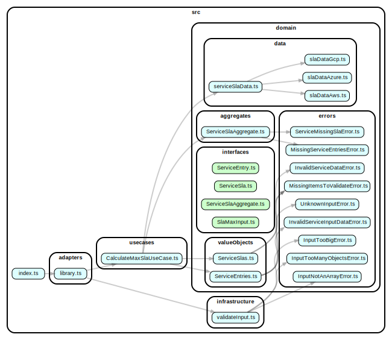

# `SlaMax`

**Calculates maximum composite SLA for a list of sequentially provided cloud services or your custom-defined services.**

Here's a few use-cases you can use `SlaMax` for:

- Continuously calculating your system's SLA base value
- Helping teams to understand what the maximum SLO they should aim for is
- Provides an easy way for architects to understand how cloud components affect the total reliability of a solution
- Increasing overall compliance and resiliency awareness

## Important to understand about SLAs

Since `SlaMax` has to generalize any given SLA into a number, it doesn't concern itself with any details around, for example, _what_ must be fulfilled on the customer side for the SLA to be applicable, or what exactly the SLA number refers to: All SLAs have various types of conditions that need to be fulfilled.

Also note that, especially on the Azure side, certain services don't have their own SLAs, but instead they refer back to other services and their SLAs. This is because they're not unique serices, but rather composed of other services.

## Installation

Run `npm install slamax` or `yarn install slamax`.

## Usage

An example using both an AWS service (see below for all available services and their keys) and a custom service (must start with `custom`). Custom items **must** include an `sla` key with a numeric value.

```TypeScript
import { SlaMax } from 'slamax';

const listOfSlas = [
  {
    "name": "aws-lambda"
  },
  {
    "name": "custom-database",
    "description": "Dev tier database on Heroku",
    "sla": 95
  }
]

const maxSla = SlaMax(listOfSlas);

console.log(`The maximum composite SLA is ${maxSla}%`);
```

## Diagram



---

## Provider SLAs used in `SlaMax`

The below outlines the various SLAs such as they're used in `SlaMax`. Refer to the linked SLA pages for more information.

### Amazon Web Services SLAs

Please refer to [https://aws.amazon.com/legal/service-level-agreements/](https://aws.amazon.com/legal/service-level-agreements/) for more information.

| **Service**                                                                                                                         | **Key**                                | **SLA**               |
| ----------------------------------------------------------------------------------------------------------------------------------- | -------------------------------------- | --------------------- |
| Alexa for Business                                                                                                                  | `alexa-for-business`                   | 99.9%                 |
| Amazon API Gateway                                                                                                                  | `amazon-api-gateway`                   | 99.95%                |
| Amazon Appstream 2.0                                                                                                                | `amazon-appstream`                     | 99.9%                 |
| Amazon Athena                                                                                                                       | `amazon-athena`                        | 99.9%                 |
| Amazon Aurora                                                                                                                       | `amazon-aurora`                        | 99.99%                |
| Amazon Braket                                                                                                                       | `amazon-braket`                        | 99.9%                 |
| Amazon Chime                                                                                                                        | `amazon-chime`                         | 99.9%                 |
| Amazon Chime Voice Connector                                                                                                        | `amazon-chime-voice-connector`         | 99.99%                |
| Amazon Cloud Directory                                                                                                              | `amazon-cloud-directory`               | 99.9%                 |
| Amazon CloudFront                                                                                                                   | `amazon-cloudfront`                    | 99.9%                 |
| Amazon CloudSearch                                                                                                                  | `amazon-cloudsearch`                   | 99.9%                 |
| Amazon CloudWatch (including Metrics API, Logs Data Ingestion API and Alarms)                                                       | `amazon-cloudwatch`                    | 99.9%                 |
| Amazon Cognito                                                                                                                      | `amazon-cognito`                       | 99.9%                 |
| Amazon Compute (including EC2, EBS, ECS & AWS Fargate)                                                                              | `amazon-compute`                       | 99.99%                |
| Amazon Compute (including EC2, EBS, ECS & AWS Fargate) (instance level)                                                             | `amazon-compute-instance`              | 99.5%                 |
| Amazon Connect                                                                                                                      | `amazon-connect`                       | 99.99%                |
| Amazon Detective                                                                                                                    | `amazon-detective`                     | 99.9%                 |
| Amazon DevOps Guru                                                                                                                  | `amazon-devops-guru`                   | 99.9%                 |
| Amazon DocumentDB (with MongoDB compatibility)                                                                                      | `amazon-documentdb`                    | 99.9%                 |
| Amazon DynamoDB (Global Tables SLA)                                                                                                 | `amazon-dynamodb-globaltables`         | 99.999%               |
| Amazon DynamoDB (standard SLA)                                                                                                      | `amazon-dynamodb`                      | 99.99%                |
| Amazon ECS Anywhere                                                                                                                 | `amazon-ecs`                           | 99.9%                 |
| Amazon Elastic File System (EFS) One Zone                                                                                           | `amazon-efs-onezone`                   | 99.9%                 |
| Amazon Elastic File System (EFS) Standard                                                                                           | `amazon-efs`                           | 99.99%                |
| Amazon Elastic Container Registry (ECR)                                                                                             | `amazon-ecr`                           | 99.9%                 |
| Amazon Elastic Container Service for Kubernetes (EKS)                                                                               | `amazon-eks`                           | 99.95%                |
| Amazon Elastic Load Balancing                                                                                                       | `amazon-elb`                           | 99.99%                |
| Amazon Elastic Transcoder                                                                                                           | `amazon-elastic-transcoder`            | 99.9%                 |
| Amazon EMR                                                                                                                          | `amazon-emr`                           | 99.9%                 |
| Amazon EventBridge                                                                                                                  | `amazon-eventbridge`                   | 99.99%                |
| Amazon Finspace                                                                                                                     | `amazon-finspace`                      | 99.9%                 |
| Amazon Forecast                                                                                                                     | `amazon-forecast`                      | 99.95%                |
| Amazon Fraud Detector                                                                                                               | `amazon-fraud-detector`                | 99.9%                 |
| Amazon FSX                                                                                                                          | `amazon-fsx`                           | 99.99%                |
| Amazon GameLift                                                                                                                     | `amazon-gamelift`                      | 99.9%                 |
| Amazon GuardDuty                                                                                                                    | `amazon-guardduty`                     | 99.9%                 |
| Amazon HealthLake                                                                                                                   | `amazon-healthlake`                    | 99.9%                 |
| Amazon Inspector                                                                                                                    | `amazon-inspector`                     | 99.9%                 |
| Amazon Interactive Video Service                                                                                                    | `amazon-interactive-video-service`     | 99.9%                 |
| Amazon Kendra                                                                                                                       | `amazon-kendra`                        | 99.9%                 |
| Amazon KeySpace for Apache Cassandra                                                                                                | `amazon-keyspaces`                     | 99.99%                |
| Amazon Kinesiss (including Data Analytics, Data Firehouse, Data Streams and Video Streaming)                                        | `amazon-kinesis`                       | 99.9%                 |
| Amazon Lightsail instance and Block Storage                                                                                         | `amazon-lightsail-instance`            | 99.99%                |
| Amazon Lightsail Managed                                                                                                            | `amazon-lightsail-managed`             | 99.95%                |
| Amazon Location                                                                                                                     | `amazon-location`                      | 99.9%                 |
| Amazon Lookout for Equipment                                                                                                        | `amazon-lookout`                       | 99.9%                 |
| Amazon Machine Learning Language (including Comprehend, Comprehend Medical, Lex, Polly, Transcribe, Transcribe Medical & Translate) | `amazon-ml`                            | 99.9%                 |
| Amazon Macie                                                                                                                        | `amazon-macie`                         | 99.9%                 |
| Amazon Managed Blockchain                                                                                                           | `amazon-managed-blockchain`            | 99.9%                 |
| Amazon Managed Grafana                                                                                                              | `amazon-managed-grafana`               | 99.9%                 |
| Amazon Managed Streaming for Apache Kafka (MSK)                                                                                     | `amazon-msk`                           | 99.9%                 |
| Amazon Managed Workflows for Apache Airflow (MWAA)                                                                                  | `amazon-mwaa`                          | 99.9%                 |
| Amazon MemoryDB for Redis                                                                                                           | `amazon-memorydb`                      | 99.9%                 |
| Amazon Messaging (SQS, SNS)                                                                                                         | `amazon-messaging`                     | 99.9%                 |
| Amazon Monitron                                                                                                                     | `amazon-monitron`                      | 99.9%                 |
| Amazon MQ                                                                                                                           | `amazon-mq`                            | 99.9%                 |
| Amazon Neptune (multi-AZ clusters)                                                                                                  | `amazon-neptune-multiaz`               | 99.9%                 |
| Amazon Nimble Studio                                                                                                                | `amazon-nimble-studio`                 | 99.9%                 |
| Amazon OpenSearch Service                                                                                                           | `amazon-opensearch`                    | 99.9%                 |
| Amazon Personalize                                                                                                                  | `amazon-personalize`                   | 99.9%                 |
| Amazon Quantum Ledger Database (QLDB)                                                                                               | `amazon-qldb`                          | 99.9%                 |
| Amazon QuickSight                                                                                                                   | `amazon-quicksight`                    | 99.9%                 |
| Amazon RDS Proxy                                                                                                                    | `amazon-rds-proxy`                     | 99.99%                |
| Amazon RedShift                                                                                                                     | `amazon-redshift`                      | 99.9%                 |
| Amazon Rekognition                                                                                                                  | `amazon-rekognition`                   | 99.9%                 |
| Amazon Relational Database Service (Amazon RDS) (multi-AZ clusters)                                                                 | `amazon-rds-multiaz`                   | 99.95%                |
| Amazon Route 53                                                                                                                     | `amazon-route53`                       | 100%                  |
| Amazon S3 Replication Time Control Feature                                                                                          | `amazon-s3-replication-time-control`   | 99.9%                 |
| Amazon SageMaker (batch transform)                                                                                                  | `amazon-sagemaker-batch`               | 99.9%                 |
| Amazon SageMaker (online inference)                                                                                                 | `amazon-sagemaker-online`              | 99.95%                |
| Amazon Simple Storage Service (S3)                                                                                                  | `amazon-s3`                            | 99.9%                 |
| Amazon Simple Workflow                                                                                                              | `amazon-simple-workflow`               | 99.9%                 |
| Amazon SimpleDB                                                                                                                     | `amazon-simpledb`                      | 99.9%                 |
| Amazon Textract                                                                                                                     | `amazon-textract`                      | 99.9%                 |
| Amazon TimeStream                                                                                                                   | `amazon-timestream`                    | 99.99%                |
| Amazon User Engagement (including Pinpoint & SES)                                                                                   | `amazon-user-engagement`               | 99.9%                 |
| Amazon VPC IP Address Manager                                                                                                       | `amazon-vpc-ip`                        | 99.9%                 |
| Amazon VPC NAT Gateway                                                                                                              | `amazon-vpc-ip-nat-gateway`            | 99.9%                 |
| Amazon WorkDocs                                                                                                                     | `amazon-workdocs`                      | 99.9%                 |
| Amazon WorkLink                                                                                                                     | `amazon-worklink`                      | 99.9%                 |
| Amazon WorkMail                                                                                                                     | `amazon-workmail`                      | 99.9%                 |
| Amazon Workspaces                                                                                                                   | `amazon-workspaces`                    | 99.9%                 |
| AWS Amplify Console                                                                                                                 | `aws-amplify`                          | 99.95%                |
| AWS Application Migration Service (MGN)                                                                                             | `aws-mgn`                              | 99.9%                 |
| AWS AppSync                                                                                                                         | `aws-appsync`                          | 99.95%                |
| AWS Audit Manager                                                                                                                   | `aws-audit-manager`                    | 99.9%                 |
| AWS Backup                                                                                                                          | `aws-backup`                           | 99.9%                 |
| AWS Budgets                                                                                                                         | `aws-budgets`                          | 99.9%                 |
| AWS Certificate Manager Private Certificate Authority                                                                               | `aws-certificate-manager-privateca`    | 99.9%                 |
| AWS Client VPN                                                                                                                      | `aws-client-vpn`                       | 99.9%                 |
| AWS Cloud Map                                                                                                                       | `aws-cloud-map`                        | 99.95%                |
| AWS CloudHSM                                                                                                                        | `aws-cloudhsm`                         | 99.95%                |
| AWS CloudTrail                                                                                                                      | `aws-cloudtrail`                       | 99.9%                 |
| AWS CodeArtifact                                                                                                                    | `aws-codeartifact`                     | 99.9%                 |
| AWS CodeBuild                                                                                                                       | `aws-codebuild`                        | 99.9%                 |
| AWS CodeCommit                                                                                                                      | `aws-codecommit`                       | 99.9%                 |
| AWS CodeDeploy                                                                                                                      | `aws-codedeploy`                       | 99.9%                 |
| AWS CodePipeline                                                                                                                    | `aws-codepipeline`                     | 99.9%                 |
| AWS Compute Optimizer                                                                                                               | `aws-compute-optimizer`                | 99.9%                 |
| AWS Config                                                                                                                          | `aws-config`                           | 99.9%                 |
| AWS Cost Explorer API                                                                                                               | `aws-cost-explorer-api`                | 99.9%                 |
| AWS Data Pipeline                                                                                                                   | `aws-data-pipeline`                    | 99.9%                 |
| AWS Database Migration Service (DMS)                                                                                                | `aws-dms`                              | 99.9%                 |
| AWS Device Farm                                                                                                                     | `aws-device-farm`                      | 99.9%                 |
| AWS Direct Connect (uptime target 99.9%)                                                                                            | `aws-direct-connect-target-999`        | 99.9%                 |
| AWS Direct Connect (uptime target 99.99%)                                                                                           | `aws-direct-connect-target-9999`       | 99.99%                |
| AWS Directory Service (including for Microsoft Active Directory, AD Connector & Simple AD)                                          | `aws-directory-service`                | 99.9%                 |
| AWS Elastic Disaster Recovery (DRS)                                                                                                 | `aws-drs`                              | 99.9%                 |
| AWS Elemental MediaConnect                                                                                                          | `aws-elemental-mediaconnect`           | 99.9%                 |
| AWS Elemental MediaConvert                                                                                                          | `aws-elemental-mediaconvert`           | 99.9%                 |
| AWS Elemental MediaLive                                                                                                             | `aws-elemental-medialive`              | 99.9%                 |
| AWS Elemental MediaPackage                                                                                                          | `aws-elemental-mediapackage`           | 99.9%                 |
| AWS Elemental MediaStore                                                                                                            | `aws-elemental-mediastore`             | 99.9%                 |
| AWS Elemental MediaTailor                                                                                                           | `aws-elemental-mediatailor`            | 99.9%                 |
| AWS Firewall Manager                                                                                                                | `aws-firewall-manager`                 | 99.9%                 |
| AWS Global Accelerator                                                                                                              | `aws-global-accelerator`               | 99.99%                |
| AWS Glue (including Studio, Crawlers, Data Catalog, Schema Registry, ETL & Databrew)                                                | `aws-glue`                             | 99.9%                 |
| AWS Ground Station                                                                                                                  | `aws-ground-station`                   | 99.9%                 |
| AWS Hybrid Storage and Data Transfer (including Storage Gateway, Datasync & transfer)                                               | `aws-hybrid-storage-and-data-transfer` | 99.9%                 |
| AWS IOT 1-click                                                                                                                     | `aws-iot-1-click`                      | 99.9%                 |
| AWS IOT Analytics                                                                                                                   | `aws-iot-analytics`                    | 99.9%                 |
| AWS IOT Core                                                                                                                        | `aws-iot-core`                         | 99.9%                 |
| AWS IOT Device Defender                                                                                                             | `aws-iot-device-defender`              | 99.9%                 |
| AWS IOT Device Management                                                                                                           | `aws-iot-device-management`            | 99.9%                 |
| AWS IOT Events                                                                                                                      | `aws-iot-events`                       | 99.9%                 |
| AWS IOT Greengrass                                                                                                                  | `aws-iot-greengrass`                   | 99.9%                 |
| AWS IOT SiteWise                                                                                                                    | `aws-iot-sitewise`                     | 99.9%                 |
| AWS IOT Things Graph                                                                                                                | `aws-iot-things-graph`                 | 99.9%                 |
| AWS Key Management Service (KMS)                                                                                                    | `aws-kms`                              | 99.999%               |
| AWS Lambda                                                                                                                          | `aws-lambda`                           | 99.95%                |
| AWS Migration Hub Refactor Spaces                                                                                                   | `aws-migration-hub-refactor-spaces`    | 99.9%                 |
| AWS Network Firewall                                                                                                                | `aws-network-firewall`                 | 99.99%                |
| AWS OpsWorks                                                                                                                        | `aws-opsworks`                         | 99.9%                 |
| AWS PrivateLink                                                                                                                     | `aws-privatelink`                      | 99.9%                 |
| AWS Resilience Hub                                                                                                                  | `aws-resilience-hub`                   | 99.9%                 |
| AWS RoboMaker                                                                                                                       | `aws-robomaker`                        | 99.9%                 |
| AWS Secrets Manager                                                                                                                 | `aws-secrets-manager`                  | 99.9%                 |
| AWS Security Hub                                                                                                                    | `aws-security-hub`                     | 99.9%                 |
| AWS Service Catalog                                                                                                                 | `aws-service-catalog`                  | 99.9%                 |
| AWS Shield Advanced                                                                                                                 | `aws-shield-advanced`                  | Unclear (set as 100%) |
| AWS Site-to-site VPN                                                                                                                | `aws-site-to-site-vpn`                 | 99.95%                |
| AWS Step Functions                                                                                                                  | `aws-step-functions`                   | 99.9%                 |
| AWS Systems Manager                                                                                                                 | `aws-systems-manager`                  | 99.9%                 |
| AWS Transit Gateway                                                                                                                 | `aws-transit-gateway`                  | 99.99%                |
| AWS WAF                                                                                                                             | `aws-waf`                              | 99.95%                |
| AWS X-Ray                                                                                                                           | `aws-xray`                             | 99.9%                 |
| ElastiCache FOR Memcaches cross-AZ configurations and ElastiCache for Redis Multi-AZ configurations                                 | `amazon-elasticache-memcached-crossaz` | 99.9%                 |

### Azure SLAs

Please refer to [https://azure.microsoft.com/en-us/support/legal/sla/](https://azure.microsoft.com/en-us/support/legal/sla/) and [https://azure.microsoft.com/en-us/support/legal/sla/summary/](https://azure.microsoft.com/en-us/support/legal/sla/summary/) for more information.

| **Service**                                                                                                                                                                              | **Key**                                        | **SLA** |
| ---------------------------------------------------------------------------------------------------------------------------------------------------------------------------------------- | ---------------------------------------------- | ------- |
| API Management - Consumption Tier, Basic Tier, Standard Tier, and Premium Tier deployments scaled within a single region                                                                 | `azure-apim-standard`                          | 99.95%  |
| API Management - Premium Tier with deployments scaled across two or more regions                                                                                                         | `azure-apim-premium-multiregion`               | 99.99%  |
| API Management - Premium Tier with deployments scaled across two or more availability zones in a region                                                                                  | `azure-apim-premium-multiaz`                   | 99.99%  |
| App Configuration                                                                                                                                                                        | `azure-app-config`                             | 99.9%   |
| App Service                                                                                                                                                                              | `azure-app-service`                            | 99.95%  |
| Application Gateway Cloud Service - Two or more medium or larger instances, or deployments capable of supporting autoscale or zone redundancy                                            | `azure-application-gateway`                    | 99.95%  |
| Automation                                                                                                                                                                               | `azure-automation`                             | 99.9%   |
| Azure Active Directory Basic and Premium services                                                                                                                                        | `azure-ad-premium`                             | 99.99%  |
| Azure Active Directory B2C                                                                                                                                                               | `azure-ad-b2c`                                 | 99.9%   |
| Azure Active Directory Domain Services                                                                                                                                                   | `azure-ad-ds`                                  | 99.9%   |
| Azure Analysis Services                                                                                                                                                                  | `azure-analysis-services`                      | 99.9%   |
| Azure Applied AI Services                                                                                                                                                                | `azure-applied-ai-services`                    | 99.9%   |
| Azure Arc                                                                                                                                                                                | `azure-arc`                                    | 99.9%   |
| Azure Backup                                                                                                                                                                             | `azure-backup`                                 | 99.9%   |
| Azure Bastion                                                                                                                                                                            | `azure-bastion`                                | 99.95%  |
| Azure Bot Services                                                                                                                                                                       | `azure-bot-services`                           | 99.9%   |
| Azure Cognitive Search                                                                                                                                                                   | `azure-cognitive-search`                       | 99.9%   |
| Azure Communication Services                                                                                                                                                             | `azure-communication-services`                 | 99.9%   |
| Azure Cosmos DB - Single Azure region using any of the 5 Consistency Levels or Database Accounts spanning multiple Azure regions, using any of the 4 relaxed Consistency Levels          | `azure-cosmosdb-single`                        | 99.99%  |
| Azure Cosmos DB - Multiple Azure regions                                                                                                                                                 | `azure-cosmosdb-multiregion`                   | 99.999% |
| Azure Data Explorer                                                                                                                                                                      | `azure-data-explorer`                          | 99.9%   |
| Azure Data Lake Storage Gen1                                                                                                                                                             | `azure-datalake-storage-gen1`                  | 99.9%   |
| Azure Data Share                                                                                                                                                                         | `azure-data-share`                             | 99.9%   |
| Azure Database for MariaDB                                                                                                                                                               | `azure-database-mariadb`                       | 99.99%  |
| Azure Database for MySQL                                                                                                                                                                 | `azure-database-mysql`                         | 99.99%  |
| Microsoft Azure Database for PostgreSQL Server - Single Server                                                                                                                           | `azure-database-postgresql-single`             | 99.99%  |
| Microsoft Azure Database for PostgreSQL, Hyperscale (Citus) High Availability Nodes                                                                                                      | `azure-database-postgresql-hyperscale`         | 99.95%  |
| Microsoft Azure Database for PostgreSQL, Flexible server configured with Zone Redundant High Availability                                                                                | `azure-database-postgresql-flex-zoneredundant` | 99.99%  |
| Microsoft Azure Database for PostgreSQL, Flexible server configured with Same Zone High Availability                                                                                     | `azure-database-postgresql-flex-samezone`      | 99.95%  |
| Microsoft Azure Database for PostgreSQL, Flexible server configured without Zone Redundant High Availability                                                                             | `azure-database-postgresql-flex`               | 99.9%   |
| Azure Databricks                                                                                                                                                                         | `azure-databricks`                             | 99.95%  |
| Azure DDoS Protection                                                                                                                                                                    | `azure-ddos-protection`                        | 99.99%  |
| Azure Defender, Standard tier                                                                                                                                                            | `azure-defender-standard`                      | 99.9%   |
| Azure DevOps Services for paid Azure DevOps Services users, incl. users with paid User-Based Extensions to Azure DevOps Services + Paid Azure Pipelines                                  | `azure-devops`                                 | 99.9%   |
| Azure Digital Twins                                                                                                                                                                      | `azure-digital-twins`                          | 99.9%   |
| Azure DNS                                                                                                                                                                                | `azure-dns`                                    | 100%    |
| Azure ExpressRoute                                                                                                                                                                       | `azure-expressroute`                           | 99.95%  |
| Azure Firewall deployed within a single Availability Zone                                                                                                                                | `azure-firewall-singlezone`                    | 99.95%  |
| Azure Firewall deployed within two or more Availability Zones in the same Azure region                                                                                                   | `azure-firewall-multizone`                     | 99.99%  |
| Azure Front Door                                                                                                                                                                         | `azure-frontdoor`                              | 99.99%  |
| Azure Functions - Consumption plan                                                                                                                                                       | `azure-functions-consumption`                  | 99.95%  |
| Azure Functions - Premium plan or the Dedicated App Service plan                                                                                                                         | `azure-functions-premium`                      | 99.95%  |
| Azure Guest Configuration for Azure Arc Connected Servers                                                                                                                                | `azure-guest-config-azurearc`                  | 99.9%   |
| Azure Health Data Services                                                                                                                                                               | `azure-health-data-services`                   | 99.9%   |
| Azure Information Protection                                                                                                                                                             | `azure-information-protection`                 | 99.9%   |
| Azure IoT Central                                                                                                                                                                        | `azure-iot-central`                            | 99.9%   |
| Azure IoT Hub                                                                                                                                                                            | `azure-iot-hub`                                | 99.9%   |
| Azure IoT Hub Device Provisioning Service                                                                                                                                                | `azure-iot-hub-dps`                            | 99.9%   |
| Azure Key Vault Managed HSM                                                                                                                                                              | `azure-keyvault-hsm`                           | 99.9%   |
| Azure Kubernetes Service (AKS) - Kubernetes API Server for AKS Clusters that use Azure Availability Zones (customer using Uptime SLA)                                                    | `azure-aks-az`                                 | 99.95%  |
| Azure Kubernetes Service (AKS) - AKS Clusters that don't use Azure Availability Zones (customer using Uptime SLA)                                                                        | `azure-aks`                                    | 99.9%   |
| Azure Lab Services                                                                                                                                                                       | `azure-lab-services`                           | 99.9%   |
| Azure Logic Apps                                                                                                                                                                         | `azure-logic-apps`                             | 99.9%   |
| Azure Managed Instance for Apache Cassandra - Cassandra Data Center deployed using Azure Managed Instance for Apache Cassandra                                                           | `azure-cassandra`                              | 99.95%  |
| Azure Managed Instance for Apache Cassandra - Cassandra Data Center deployed with Availability Zone support enabled in an Azure region that supports Availability Zones                  | `azure-cassandra-az`                           | 99.99%  |
| Azure Maps                                                                                                                                                                               | `azure-maps`                                   | 99.9%   |
| Azure Monitor                                                                                                                                                                            | `azure-monitor`                                | 99.9%   |
| Log Analytics                                                                                                                                                                            | `azure-log-analytics`                          | 99.9%   |
| Application Insights                                                                                                                                                                     | `azure-application-insights`                   | 99.9%   |
| Azure NetApp Files                                                                                                                                                                       | `azure-netapp-files`                           | 99.99%  |
| Azure Private Link                                                                                                                                                                       | `azure-private-link`                           | 99.99%  |
| Azure Purview                                                                                                                                                                            | `azure-purview`                                | 99.9%   |
| Azure Red Hat OpenShift                                                                                                                                                                  | `azure-redhat-openshift`                       | 99.9%   |
| Azure Route Server                                                                                                                                                                       | `azure-route-server`                           | 99.95%  |
| Azure SignalR Service                                                                                                                                                                    | `azure-signalr-service`                        | 99.9%   |
| Azure Site Recovery - Protected Instance configured for On-Premises-to-On-Premises Failover                                                                                              | `azure-site-recovery`                          | 99.9%   |
| Azure Spring Cloud                                                                                                                                                                       | `azure-spring-cloud`                           | 99.9%   |
| Azure SQL Database - General Purpose, Business Critical or Premium tiers configured as Zone Redundant Deployments                                                                        | `azure-sql-general-zone`                       | 99.995% |
| Azure SQL Database - General Purpose, Business Critical or Premium tiers not configured for Zone Redundant Deployments                                                                   | `azure-sql-general`                            | 99.99%  |
| Azure SQL Database - Basic or Standard tiers                                                                                                                                             | `azure-sql-standard`                           | 99.99%  |
| Azure SQL Database - Hyperscale tier with two or more replicas have an availability guarantee                                                                                            | `azure-sql-hyperscale-multi-replica`           | 99.99%  |
| Azure SQL Database - Hyperscale tier with one replica                                                                                                                                    | `azure-sql-hyperscale-one-replica`             | 99.95%  |
| Azure SQL Database - Hyperscale tier with zero replicas                                                                                                                                  | `azure-sql-hyperscale`                         | 99.9%   |
| Azure SQL Managed Instance                                                                                                                                                               | `azure-sql-managed`                            | 99.99%  |
| Azure Stream Analytics                                                                                                                                                                   | `azure-stream-analytics`                       | 99.9%   |
| Azure Synapse Analytics                                                                                                                                                                  | `azure-synapse-analytics`                      | 99.9%   |
| Azure Synapse Analytics - Apache Spark                                                                                                                                                   | `azure-synapse-analytics-spark`                | 99%     |
| Azure Time Series Insights                                                                                                                                                               | `azure-timeseries-insights`                    | 99.9%   |
| Azure VMware Solution                                                                                                                                                                    | `azure-vmware-solution`                        | 99.9%   |
| Azure VMware Solution by CloudSimple                                                                                                                                                     | `azure-vmware-solution-cloudsimple`            | 99.9%   |
| Azure VNet NAT                                                                                                                                                                           | `azure-vnet-nat`                               | 99.99%  |
| Azure Web PubSub                                                                                                                                                                         | `azure-web-pubsub`                             | 99.9%   |
| BareMetal Infrastructure - High Availability pair                                                                                                                                        | `azure-baremetal-ha-pair`                      | 99.99%  |
| BareMetal Infrastructure - Single Instance                                                                                                                                               | `azure-baremetal-single`                       | 99.9%   |
| BizTalk Services - Basic, Standard and Premium tiers                                                                                                                                     | `azure-biztalk-standard`                       | 99.9%   |
| Cache - Standard, Premium, Enterprise, and Enterprise Flash tier                                                                                                                         | `azure-cache-standard`                         | 99.9%   |
| Cache - Enterprise and Enterprise Flash tier Cache deployed to three or more Availability Zones in the same Azure region                                                                 | `azure-cache-enterprise`                       | 99.99%  |
| Cache - Enterprise and Enterprise Flash tier Cache deployed to min. 3 Azure regions and 3 or more Availability Zones in each region + w/ geo-replication enabled for all Cache instances | `azure-cache-enterprise-georeplica`            | 99.999% |
| Cloud Services - two or more role instances in different fault and upgrade domains                                                                                                       | `azure-cloud-services`                         | 99.95%  |
| Virtual Machines that have two or more instances deployed in the same Availability Set                                                                                                   | `azure-vm-multi-instance`                      | 99.95%  |
| Single Instance Virtual Machine using premium storage for all disks                                                                                                                      | `azure-vm-single-premium-storage`              | 99.9%   |
| Cognitive Services Standard tier                                                                                                                                                         | `azure-cognitive-services-standard`            | 99.9%   |
| Content Delivery Network (CDN)                                                                                                                                                           | `azure-cdn`                                    | 99.9%   |
| Cost Management + Billing                                                                                                                                                                | `azure-cost-management`                        | 99.9%   |
| Data Catalog                                                                                                                                                                             | `azure-data-catalog`                           | 99.9%   |
| Data Lake Analytics                                                                                                                                                                      | `azure-datalake-analytics`                     | 99.9%   |
| Event Grid                                                                                                                                                                               | `azure-eventgrid`                              | 99.9%   |
| Event Hubs - Basic and Standard tiers                                                                                                                                                    | `azure-eventhub-standard`                      | 99.95%  |
| Event Hubs - Premium and Dedicated tiers                                                                                                                                                 | `azure-eventhub-premium`                       | 99.99%  |
| HDInsight                                                                                                                                                                                | `azure-hdinsight`                              | 99.9%   |
| Health Bot                                                                                                                                                                               | `azure-healthbot`                              | 99.9%   |
| Key Vault                                                                                                                                                                                | `azure-keyvault`                               | 99.99%  |
| Load Balancer                                                                                                                                                                            | `azure-load-balancer`                          | 99.99%  |
| Machine Learning Studio - Request Response Service (RRS)                                                                                                                                 | `azure-mlstudio-rrs`                           | 99.95%  |
| Machine Learning Studio - Batch Execution Service (BES) and management APIs                                                                                                              | `azure-mlstudio-bes`                           | 99.9%   |
| Media Services                                                                                                                                                                           | `azure-media-services`                         | 99.9%   |
| Mobile Services - Standard and Premium tiers                                                                                                                                             | `azure-mobile-services-standard`               | 99.9%   |
| Network Watcher                                                                                                                                                                          | `azure-network-watcher`                        | 99.9%   |
| On Demand Capacity Reservations for Virtual Machines                                                                                                                                     | `azure-vm-ondemand-reservations`               | 99.9%   |
| Power BI Embedded                                                                                                                                                                        | `azure-powerbi-embedded`                       | 99.9%   |
| Remote Rendering                                                                                                                                                                         | `azure-remote-rendering`                       | 99.9%   |
| SAP HANA on Azure Large Instances - Configured in a High Availability Pair                                                                                                               | `azure-sap-ha`                                 | 99.99%  |
| SAP HANA on Azure Large Instances - Single Instance                                                                                                                                      | `azure-sap-single`                             | 99.9%   |
| Scheduler                                                                                                                                                                                | `azure-scheduler`                              | 99.9%   |
| Service Bus                                                                                                                                                                              | `azure-service-bus`                            | 99.9%   |
| Spatial Anchors                                                                                                                                                                          | `azure-spatial-anchors`                        | 99.9%   |
| SQL Server Stretch Database                                                                                                                                                              | `azure-sql-server-stretch-database`            | 99.9%   |
| Static Web Apps - Standard hosting plan                                                                                                                                                  | `azure-staticwebapps-standard`                 | 99.95%  |
| Storage Accounts - Read Access-Geo Redundant Storage (RA-GRS) Accounts                                                                                                                   | `azure-storage-ragrs-account`                  | 99.99%  |
| Storage Accounts - Read Access-Geo Redundant Storage (RA-GRS) Accounts (Cool and Archive Access Tiers)                                                                                   | `azure-storage-ragrs-account-cool`             | 99.9%   |
| Storage Accounts - Locally Redundant Storage (LRS), Zone Redundant Storage (ZRS), and Geo Redundant Storage (GRS)                                                                        | `azure-storage-grs-storage`                    | 99.9%   |
| Storage Accounts - Locally Redundant Storage (LRS), Zone Redundant Storage (ZRS), and Geo Redundant Storage (GRS) (Cool and Archive Access Tiers)                                        | `azure-storage-grs-storage-cool`               | 99%     |
| StorSimple                                                                                                                                                                               | `azure-storsimple`                             | 99.9%   |
| Traffic Manager                                                                                                                                                                          | `azure-traffic-manager`                        | 99.9%   |
| Virtual WAN                                                                                                                                                                              | `azure-virtual-wan`                            | 99.95%  |
| Visual Studio App Center                                                                                                                                                                 | `azure-appcenter`                              | 99.9%   |
| VPN Gateway - Basic Gateway for VPN or Basic Gateway for ExpressRoute                                                                                                                    | `azure-vpn-basic-expressroute`                 | 99.9%   |
| VPN Gateway - Standard, High Performance, VpnGw1, VpnGw2, VpnGw3 Gateway for VPN                                                                                                         | `azure-vpn-standard`                           | 99.95%  |
| VPN Gateway - Standard, High Performance, Ultra Performance Gateway for ExpressRoute                                                                                                     | `azure-vpn-standard-expressroute`              | 99.95%  |
| Windows 10 IoT Core Services                                                                                                                                                             | `azure-win10-iot-core-services`                | 99.9%   |

### Google Cloud Platform SLAs

Please refer to [https://cloud.google.com/terms/sla](https://cloud.google.com/terms/sla) for more information.

| **Service**                                                                                                            | **Key**                                                             | **SLA** |
| ---------------------------------------------------------------------------------------------------------------------- | ------------------------------------------------------------------- | ------- |
| AI Platform Training and Prediction                                                                                    | `gcp-ai-platform`                                                   | 99.5%   |
| Apigee Standard                                                                                                        | `gcp-apigee-standard`                                               | 99%     |
| Apigee Enterprise single-region                                                                                        | `gcp-apigee-enterprise`                                             | 99.9%   |
| Apigee Enterprise multi-region (includes Apigee Enterprise Plus)                                                       | `gcp-apigee-enterprise-multiregion`                                 | 99.99%  |
| App Engine                                                                                                             | `gcp-app-engine`                                                    | 99.95%  |
| Cloud Translation and AutoML Translation (Basic, Advanced, AutoML)                                                     | `gcp-cloud-translation`                                             | 99.9%   |
| Bare Metal Solution                                                                                                    | `gcp-baremetal`                                                     | 99.9%   |
| BigQuery                                                                                                               | `gcp-bigquery`                                                      | 99.99%  |
| Cloud Bigtable Zonal instance (single cluster)                                                                         | `gcp-bigtable-single-cluster`                                       | 99.9%   |
| Cloud Bigtable Replicated Instance (2 or more clusters) with Single-Cluster routing policy                             | `gcp-bigtable-replicated-single-cluster-routing`                    | 99.9%   |
| Cloud Bigtable Replicated Instance (2 or more clusters) with Multi-Cluster routing policy (3 or more Regions)          | `gcp-bigtable-replicated-multicluster-routing-3-or-more-regions`    | 99.999% |
| Cloud Bigtable Replicated Instance (2 or more clusters) with Multi-Cluster routing policy (fewer than 3 Regions)       | `gcp-bigtable-replicated-multicluster-routing-fewer-than-3-regions` | 99.99%  |
| Cloud Build                                                                                                            | `gcp-cloud-build`                                                   | 99.95%  |
| Cloud CDN                                                                                                              | `gcp-cloud-cdn`                                                     | 99.95%  |
| Cloud DLP                                                                                                              | `gcp-cloud-dlp`                                                     | 99.5%   |
| Cloud DNS                                                                                                              | `gcp-cloud-dns`                                                     | 100%    |
| Cloud External Key Manager                                                                                             | `gcp-external-key-manager`                                          | 99.5%   |
| Cloud Filestore Basic SSD or Cloud Filestore Basic HDD                                                                 | `gcp-cloud-filestore`                                               | 99.9%   |
| Cloud Filestore Enterprise                                                                                             | `gcp-cloud-filestore-enterprise`                                    | 99.99%  |
| Cloud Functions                                                                                                        | `gcp-cloud-functions`                                               | 99.95%  |
| Cloud Key Management Service and Cloud HSM - Operations originating from a Customer Application or Customer End User   | `gcp-cloud-key-management`                                          | 99.95%  |
| Cloud Key Management Service and Cloud HSM - Operations requested by service account (incl. via CMEK-enabled services) | `gcp-cloud-key-management-service-account`                          | 99.99%  |
| Cloud Healthcare                                                                                                       | `gcp-cloud-healthcare`                                              | 99.9%   |
| Cloud Identity                                                                                                         | `gcp-cloud-identity`                                                | 99.9%   |
| Cloud Dedicated and Partner Interconnect - Interconnect service for production-level applications                      | `gcp-interconnect-production`                                       | 99.9%   |
| Cloud Dedicated and Partner Interconnect - Interconnect service for non-critical applications                          | `gcp-interconnect-noncritical`                                      | 99.9%   |
| Cloud Dedicated and Partner Interconnect - Dedicated IC, single IC or multiple IC in 1 edge domain                     | None                                                                | None    |
| Cloud Dedicated and Partner Interconnect - Partner IC, single VLAN attachment or multiple VLAN in 1 edge domain        | None                                                                | None    |
| Cloud Key Management Service and Cloud HSM - Operations originating from a Customer Application or Customer End User   | `gcp-cloud-hsm`                                                     | 99.95%  |
| Cloud Key Management Service and Cloud HSM - Operations requested by service account (incl. via CMEK-enabled services) | `gcp-cloud-hsm-service-account`                                     | 99.99%  |
| Cloud NAT                                                                                                              | `gcp-cloud-nat`                                                     | 99.9%   |
| Cloud Natural Language API and AutoML Natural Language                                                                 | `gcp-natural-language`                                              | 99.9%   |
| Cloud Run                                                                                                              | `gcp-cloud-run`                                                     | 99.95%  |
| Cloud Spanner - Multi-Regional Instance                                                                                | `gcp-spanner-multiregion`                                           | 99.999% |
| Cloud Spanner - Regional Instance                                                                                      | `gcp-spanner-regional`                                              | 99.99%  |
| Cloud SQL                                                                                                              | `gcp-cloud-sql`                                                     | 99.95%  |
| Cloud Storage - Standard storage class in a multi-region or dual-region location of Cloud Storage                      | `gcp-cloud-storage-multiregion`                                     | 99.95%  |
| Cloud Storage - Standard class in regional Storage; Nearline, Coldline, or Archive storage in multi-region location    | `gcp-cloud-storage-regional`                                        | 99.9%   |
| Cloud Storage - Nearline, Coldline, or Archive class in regional location; Durable Reduced in any location of Storage  | `gcp-cloud-storage-reduced`                                         | 99%     |
| Cloud Storage - Any Cloud Storage bucket for which turbo replication feature has been activated the entire month       |                                                                     |         |
| -> Monthly Replication Time Conformance                                                                                | `gcp-cloud-storage-turbo-time`                                      | 99.9%   |
| -> Monthly Replication Volume Conformance                                                                              | `gcp-cloud-storage-turbo-volume`                                    | 99.9%   |
| Cloud Storage for Firebase - Multi-Regional Storage class of Google Cloud Storage                                      | `gcp-cloud-storage-firebase-multiregion`                            | 99.95%  |
| Cloud Storage for Firebase - Regional Storage class of Google Cloud Storage                                            | `gcp-cloud-storage-firebase-regional`                               | 99.9%   |
| Cloud Storage for Firebase - Nearline, Coldline and Durable Reduced Availability Storage classes of Cloud Storage      | `gcp-cloud-storage-firebase-reduced`                                | 99%     |
| Cloud Tasks                                                                                                            | `gcp-cloud-tasks`                                                   | 99.95%  |
| Cloud Vision and AutoML Vision                                                                                         | `gcp-cloud-vision`                                                  | 99.9%   |
| Cloud VPN - Classic VPN                                                                                                | `gcp-cloud-vpn-classic`                                             | 99.9%   |
| Cloud VPN - High-availability (HA) VPN                                                                                 | `gcp-cloud-vpn-ha`                                                  | 99.99%  |
| Compute Engine - Instances in Multiple Zones                                                                           | `gcp-compute-engine-multizone`                                      | 99.99%  |
| Compute Engine - Single Instance                                                                                       | `gcp-compute-engine-single`                                         | 99.5%   |
| Compute Engine - Load balancing                                                                                        | `gcp-compute-engine-lb`                                             | 99.99%  |
| Data Catalog                                                                                                           | `gcp-data-catalog`                                                  | 99.9%   |
| Dataflow                                                                                                               | `gcp-dataflow`                                                      | 99.9%   |
| Dataplex                                                                                                               | `gcp-dataplex`                                                      | 99.5%   |
| Dataproc                                                                                                               | `gcp-dataproc`                                                      | 99.5%   |
| Datastore Multi-Region                                                                                                 | `gcp-datastore-multiregion`                                         | 99.95%  |
| Datastore Regional                                                                                                     | `gcp-datastore-regional`                                            | 99.9%   |
| Dialogflow                                                                                                             | `gcp-dialogflow`                                                    | 99.9%   |
| Document AI                                                                                                            | `gcp-document-ai`                                                   | 99.9%   |
| Firestore Multi-Region                                                                                                 | `gcp-firestore-multiregion`                                         | 99.999% |
| Firestore Regional                                                                                                     | `gcp-firestore-regional`                                            | 99.99%  |
| Google Cloud Armor                                                                                                     | `gcp-cloud-armor`                                                   | 99.99%  |
| Google Cloud VMware Engine - Cluster in a single Zone with 5 to 16 nodes and FTT=2 or more                             | `gcp-cloud-vmware-ftt2`                                             | 99.99%  |
| Google Cloud VMware Engine - Cluster in a single Zone with 3 or 4 nodes and FTT=1                                      | `gcp-cloud-vmware-ftt1`                                             | 99.9%   |
| Google Cloud VMware Engine - Management Interfaces                                                                     | `gcp-cloud-vmware-management`                                       | 99.9%   |
| Google Kubernetes Engine - Zonal Cluster (control plane)                                                               | `gcp-gke-zonal`                                                     | 99.5%   |
| Google Kubernetes Engine - Regional Cluster (control plane)                                                            | `gcp-gke-regional`                                                  | 99.95%  |
| Google Kubernetes Engine - Autopilot Cluster (control plane)                                                           | `gcp-gke-autopilot`                                                 | 99.95%  |
| Google Kubernetes Engine - Autopilot Pods in Multiple Zones                                                            | `gcp-gke-autopilot-multizone`                                       | 99.9%   |
| Identity Platform                                                                                                      | `gcp-identity-platform`                                             | 99.95%  |
| IoT Core                                                                                                               | `gcp-iot-core`                                                      | 99.9%   |
| Managed Microsoft AD                                                                                                   | `gcp-managed-microsoft-ad`                                          | 99.9%   |
| Memorystore                                                                                                            | `gcp-memorystore`                                                   | 99.9%   |
| Network Connectivity Center                                                                                            | `gcp-network-connectivity-center`                                   | 99.95%  |
| Operations                                                                                                             | `gcp-operations`                                                    | 99.95%  |
| Pub/Sub                                                                                                                | `gcp-pubsub`                                                        | 99.95%  |
| Pub/Sub Lite regional topics                                                                                           | `gcp-pubsub-lite-regional`                                          | 99.95%  |
| Pub/Sub Lite zonal topics                                                                                              | `gcp-pubsub-lite-zonal`                                             | 99.5%   |
| reCAPTCHA Enterprise                                                                                                   | `gcp-recaptcha-enterprise`                                          | 99.9%   |
| Secret Manager                                                                                                         | `gcp-secret-manager`                                                | 99.95%  |
| Security Command Center                                                                                                | `gcp-security-command-center`                                       | 99.9%   |
| Speech-to-Text                                                                                                         | `gcp-speech-to-text`                                                | 99.9%   |
| Talent Solution Job Search                                                                                             | `gcp-talent-solution`                                               | 99.9%   |
| Text-to-Speech                                                                                                         | `gcp-text-to-speech`                                                | 99.9%   |
| Workflows                                                                                                              | `gcp-workflows`                                                     | 99.9%   |
| Vertex AI - Training, Deployment, Batch Prediction; Tabular, Image Online Prediction; Text Language Online Prediction  | `gcp-vertex-ai-prediction`                                          | 99.9%   |
| Vertex AI - Custom Model Online Prediction for models deployed on 2 or more nodes; Vertex Pipelinesasdf                | `gcp-vertex-ai-custom`                                              | 99.5%   |
| Video Intelligence API                                                                                                 | `gcp-video-intelligence`                                            | 99.9%   |
